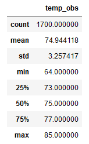
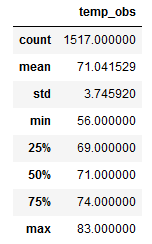
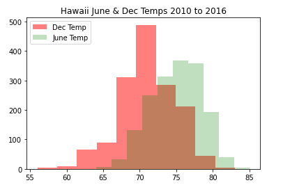
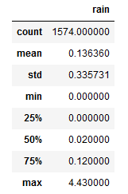
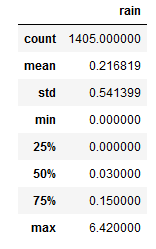
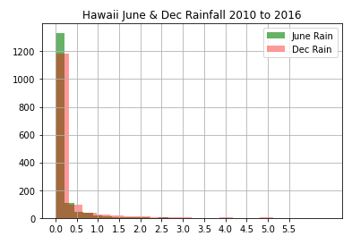

# Surfs Up Weather Analysis
# Purpose of Analysis
W. Avy requested an analysis of temperatures in Oahu, Hawaii for the months of June and December.  He wants to understand how the temperature varies between summer and winter to see if the Surf & Ice Cream shop is viable year round.
# Results for Analysis
In order to answer W. Avy's question we sampled the weather database and extracted temperature observations for June and December from 2010 to 2016.  The statistical summary of results for both months  and a graphical comparison is shown below.
<figure>

 

  
<figcaption align = "center"><b>Fig.1 -June & December Temperature Statistics and Histogram</b></figcaption>

<figure>

- The average temperature for June was 75 degrees and for December was 75 degrees.  
- The difference of of 4 degrees was a 5% drop but would not likely feel different to visitors.  
- The temperature variation for both months is very close at 3.7 degrees for December compared to 3.2 degrees for June.  The total range of temperatures in December is 17 degrees versus 21 degrees for June.  
- The low temperature for December was 56 degrees which would feel noticeably cooler to visitors than the June low of 64 degrees.
# Summary and Recommendations
In general visitors in December or June will not experience significant temperature differences.  While December is slightly cooler and will have a few days where the temperature is measureably less than June, it is a small number of occurrences.  

As a recommendation, W. Avy should consider reviewing the rainfall data for December and June.  While the temperatures are not significantlyt different, the other deterrent to visitors would be rain.  If either of the months have a higher frequency or volume of rain the busienss could suffer.  An initial look at the rain data is provided below.
<figure>

 

  
<figcaption align = "center"><b>Fig.2 -June & December Rainfall Statistics and Histogram</b></figcaption>

<figure>
  
As a final element of analysis, W. Avy should consider looking average high and low values for rain and temperature in a time series by month.  This view could be presented as line charts over time or with additional queries presented as a series box plots by month.
